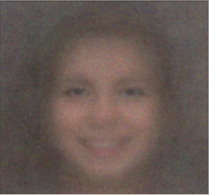
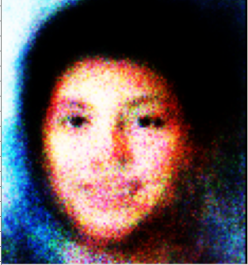
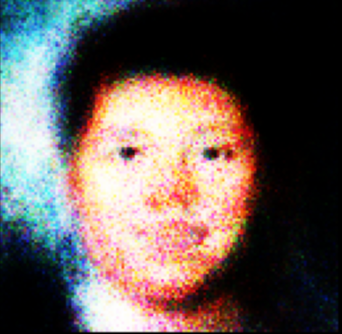
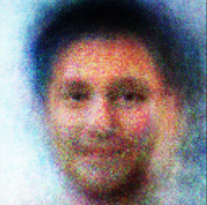

## Avatar Generator
- Created python script to train GAN based on public face image dataset
- Simple flask server to display a unique generated face image based on our trained GAN model.
- Each refresh produces a new image.

## Example Outputs

  
  
  
  
  

## Google Slides Presentation for Class

https://docs.google.com/presentation/d/e/2PACX-1vSeJBOfgCZ2Zo61L4AMSWQX8O_2D01xK1gu-E63RGRJUya2Q98xTi5XKRTkkmstMos1kpRGLzS9cB4x/pub?start=false&loop=false&delayms=3000
